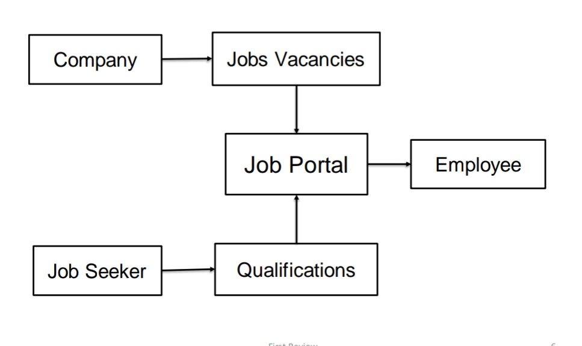

# Job Portal System
A C++ mini project for object Oriented Programming. This is only C++ implementation.
 <b>Main concepts:</b> Object Oriented Programming, Files in C++
 
 
 
documentation below done for just academic's sake
## Abstract
- India has one of the highest youth population in the world. One of the major 
social issues in India is unemployment.
- India faces a paradoxical situation where, on the one hand, youth is looking for 
job and on the other hand industry is suffering from availability of skilled workers.
- With increase in world population and need of money, getting a better job 
becomes mandatory. Hence it is high time to effectively manage the youth 
unemployment problem.
- Also here the concept is providing information about job vacancies available for 
the applicants i.e. unemployed youths and it can be given by the company itself.
- The companies can login and keep posting job opportunities and the job seekers 
can view job opportunities and keep applying.
- Using Object Oriented Programming concepts, the job portal can be managed.

## Literature Survey
> Job Seeking: Old and New Ways
- In old days job seekers have to involve different complicated ways to look for 
jobs such as through News papers, job agency office, advertisements in TV 
and radio etc. Before the Internet, became widely uses as a method of 
seeking jobs, jobseekers spent a lots of time using various methods to look 
for job opportunities. 
- Today, jobseekers can use online methods which are very convenient and 
save a lot of time. Finding all available job vacancies is a main step at in the 
job-seeking process. The Internet is now a powerful tool that jobseekers can 
use. 
- The Internet plays an important role in the area of human resource planning 
and development. In the age of technology, the Internet has become the 
main source of information for jobseekers.
## Existing System
- There are few existing systems available with the same concept. But 
not the exactly same and not efficient.
- The existing methods involves some drawbacks such as a job seeker 
can able to search job opportunities online but not in one place. Job 
seekers need to use multiple resources to know multiple the job 
opportunities and vacancies available.
- After attanding the job interviews, only the selected candidates are 
being informed. And the candidates who were not selected by the 
company, are not informed by lot of companies. They were waiting for 
the result and lacks of time.

## Proposed System
- The proposed system provides the information about Multiple Job 
Opportunities from multiple companies in one place.
- Also the opportunities can be posted by a recruiting company itself, so that 
the information would be trustable.
- The proposed system of job portal works as a medium between job 
offering company and job seeking applicants.
- Job seekers can update their profile, view all the job opportunities available 
and apply for the same. They will be informed the status of their 
applications.

## Block Diagram of proposed System

## Algorithm
#### Company:
Step 1: Start 
Step 2: Register/Login 
Step 3: Update company information 
Step 4: Post job opportunities and details 
Step 5: Recruite employee 
Step 6: Logout 
#### Job Seeker:
Step 1: Start  
Step 2: Register/Login  
Step 3: Update information - name, phone no., resume. 
Step 4: View job opportunities 
Step 5: Apply for job 
Step 6: View status of application 
Step 7: Logout 

## Techniques to be used for the project implementation
> Object Oriented Programming
- Class
- Inheritance
  - Multiple inheritance
> Server side programming
- Files

## Simulation Diagram and Results

## Expected Outcomes 
* The project Online Job Portal has been successfully designed and tested. 
It has developed by integrating entire software used in this project.
* The presence of any information has been reasoned and placed carefully 
thus contribute to the best work of the units.
* Besides that, this system can reduce lacks of time to search job 
opportunities and could help to get employed.
* By using this system, companies can recruit skilled employees and the 
unemployed graduates or final year students can get good job.
